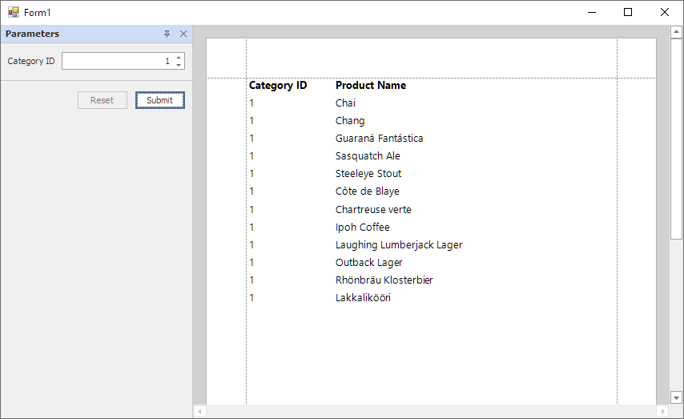

<!-- default badges list -->

<!-- default badges end -->
# Reporting for WinForms - Use Query Parameter to Filter Report Data at the Data Source Level

This example shows how to use [query parameter](https://docs.devexpress.com/XtraReports/17387/detailed-guide-to-devexpress-reporting/bind-reports-to-data/sql-database/specify-query-parameters) to filter report data at the data source level. 

## Files to Review

* [Program.cs](CS/QueryParametersRuntime/Program.cs) (VB: [Program.vb](VB/QueryParametersRuntime/Program.vb))
* [XtraReport1.cs](CS/QueryParametersRuntime/XtraReport1.cs) (VB: [XtraReport1.vb](VB/QueryParametersRuntime/XtraReport1.vb))

## Documentation

- [Use Report Parameter to Filter Report Data at the Data Source Level](https://docs.devexpress.com/XtraReports/17387/detailed-guide-to-devexpress-reporting/bind-reports-to-data/sql-database/specify-query-parameters#use-report-parameter-to-filter-report-data-at-the-data-source-level)
- [Filter Data](https://docs.devexpress.com/XtraReports/119450/detailed-guide-to-devexpress-reporting/shape-report-data/filter-data)
- [Use Expressions](https://docs.devexpress.com/XtraReports/120091/detailed-guide-to-devexpress-reporting/use-expressions)
- [Use Report Parameters](https://docs.devexpress.com/XtraReports/4812/detailed-guide-to-devexpress-reporting/use-report-parameters)
## More Examples

- [Reporting for ASP NET.Core - Implement Row-Level Security](https://github.com/DevExpress-Examples/asp-net-core-reporting-row-level-security)
- [Row-Level Filtering in ASP.NET Core Reporting Application with SqlDataSource (Multi-Tenancy Support)](https://github.com/DevExpress-Examples/Reporting-Multi-Tenancy-Security-Filter)
- [SqlDataSource - How to use ExpressionEvaluator to programmatically filter report data](https://github.com/DevExpress-Examples/Reporting_sqldatasource-how-to-use-expressionevaluator-to-programmatically-filter-report-t328522)

<!-- feedback -->
## Does this example address your development requirements/objectives?

 

(you will be redirected to DevExpress.com to submit your response)
<!-- feedback end -->
